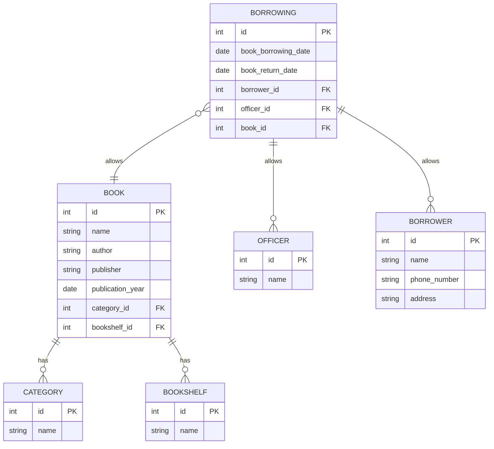

# ERD Library System

```mermaid
erDiagram


BOOK ||--o{ CATEGORY : has
BOOK ||--o{ BOOKSHELF : has
BOOK {
  int id PK
  string name
  string author
  string publisher
  date publication_year
  int category_id FK
  int bookshelf_id FK
}

CATEGORY {
 int id PK
 string name
}

BOOKSHELF{
  int id PK
  string name
}

OFFICER {
  int id PK
  string name
}

BORROWER {
  int id PK
  string name
  string phone_number
  string address
}

BORROWING }o--|| BOOK : allows
BORROWING ||--o{ OFFICER : allows
BORROWING ||--o{ BORROWER : allows
BORROWING {
  int id PK
  date book_borrowing_date
  date book_return_date
  int borrower_id FK
  int officer_id FK
  int book_id FK
}

```
