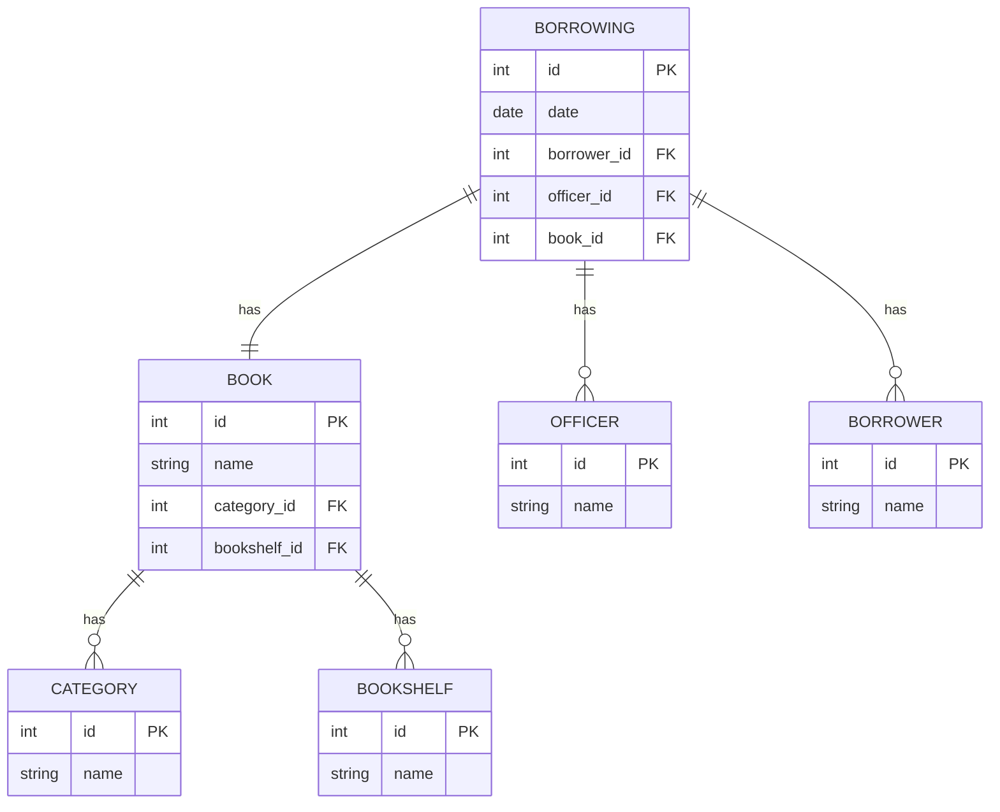

```mermaid
erDiagram

BOOK ||--o{ CATEGORY : has
BOOK ||--o{ BOOKSHELF : has
BOOK {
  int id PK
  string name
  int category_id FK
  int bookshelf_id FK
}

CATEGORY {
 int id PK
 string name
}

BOOKSHELF{
  int id PK
  string name
}

OFFICER {
  int id PK
  string name
}

BORROWER {
  int id PK
  string name
}

BORROWING ||--|| BOOK : has
BORROWING ||--o{ OFFICER : has
BORROWING ||--o{ BORROWER : has
BORROWING {
  int id PK
  date date
  int borrower_id FK
  int officer_id FK
  int book_id FK
}

```
